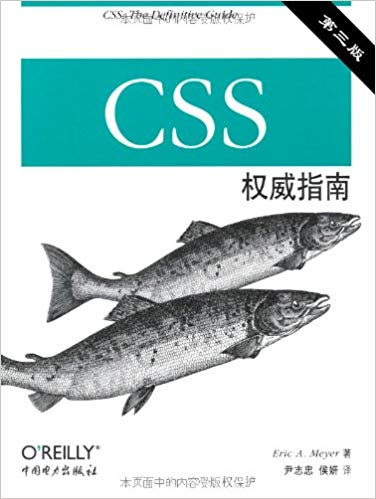

# CSS-The-Definitive-Guide

> **CSS 权威指南（第三版） 读书笔记**

## 目录索引

### [第 1 章 CSS 和文档](https://github.com/zonghua2016/CSS-The-Definitive-Guide/blob/master/docs/1%E3%80%81css%20%E5%92%8C%20%E6%96%87%E6%A1%A3.md)
### [第 2 章 选择器](https://github.com/zonghua2016/CSS-The-Definitive-Guide/blob/master/docs/2%E3%80%81%E9%80%89%E6%8B%A9%E5%99%A8.md)
### [第 3 章 结构和层叠](https://github.com/zonghua2016/CSS-The-Definitive-Guide/blob/master/docs/3%E3%80%81%E7%BB%93%E6%9E%84%E5%92%8C%E5%B1%82%E5%8F%A0.md)
### [第 4 章 值和单位](https://github.com/zonghua2016/CSS-The-Definitive-Guide/blob/master/docs/4%E3%80%81%E5%80%BC%E5%92%8C%E5%8D%95%E4%BD%8D.md)
### [第 5 章 字体](https://github.com/zonghua2016/CSS-The-Definitive-Guide/blob/master/docs/5%E3%80%81%E5%AD%97%E4%BD%93.md)
### [第 6 章 文本属性](https://github.com/zonghua2016/CSS-The-Definitive-Guide/blob/master/docs/6%E3%80%81%E6%96%87%E6%9C%AC%E5%B1%9E%E6%80%A7.md)
### [第 7 章 基本视觉格式化](https://github.com/zonghua2016/CSS-The-Definitive-Guide/blob/master/docs/7%E3%80%81%E5%9F%BA%E6%9C%AC%E8%A7%86%E8%A7%89%E6%A0%BC%E5%BC%8F%E5%8C%96.md)