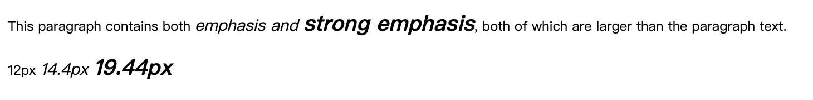
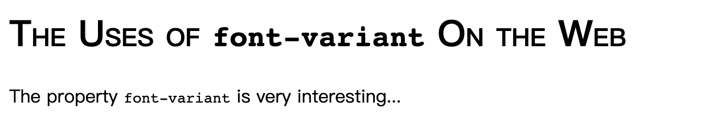
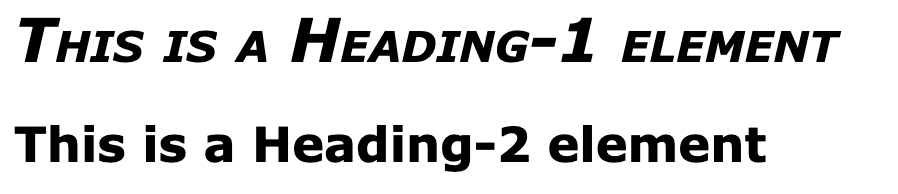
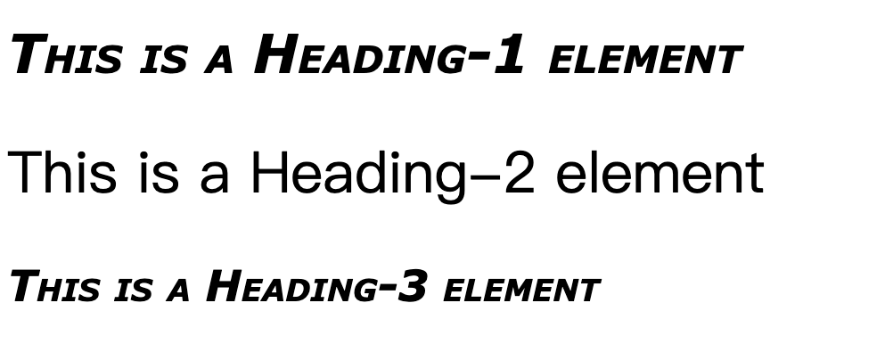

### 字体系列

- 使用通用字体系列

css定义了 5 中通用字体系列:

    Serif
    Sans-serif
    Monospace
    Cursive
    Fantasy
    

<html>
    <table>
        <tr>
            <td colspan="2" style="text-align:center; font-weight: bold;">font-family</td>
        </tr>
        <tr>
            <td>值：</td>
            <td><family-name> | inherit</td>
        </tr>
        <tr>
            <td>初始值：</td>
            <td>用户代理指定的值</td>
        </tr>
        <tr>
            <td>应用于：</td>
            <td>所有元素</td>
        </tr>
        <tr>
            <td>继承性：</td>
            <td>有</td>
        </tr>
        <tr>
            <td>计算值：</td>
            <td>根据指定确定</td>
        </tr>
    </table>
</html>

```css
body {font-family: sans-serif;}
```

这样用户代理就会从 sans-serif 字体系列选择一个字体（如 Helvetica），并将其应用到 body 元素，因为有继承性，这种字体选择还将应用到 body 元素中包含的所有元素，除非有一种更特定的选择器将其覆盖

- 指定字体系列

```css
p {font-family: Times, TimesNR, 'New Century Schoolbook', Georgia, 'New York', serif;}
```
根据这个列表，用户代理会按所列的顺序查找这些字体。如果列出的所有字体都不可用，就会简单的选择一种可用的 serif 字体

### 字体加粗

<html>
    <table>
        <tr>
            <td colspan="2" style="text-align:center; font-weight: bold;">font-weight</td>
        </tr>
        <tr>
            <td>值：</td>
            <td>normal | bold | bolder | lighter | 100 | 200 | 300 | 400 | 500 | 600 | 700 | 800 | 900 | inherit</td>
        </tr>
        <tr>
            <td>初始值：</td>
            <td>normal</td>
        </tr>
        <tr>
            <td>应用于：</td>
            <td>所有元素</td>
        </tr>
        <tr>
            <td>继承性：</td>
            <td>有</td>
        </tr>
        <tr>
            <td>计算值：</td>
            <td>数字值（如 100 等），或某个数字值加上某个相对数（bolder 或 lighter）</td>
        </tr>
    </table>
</html>

一般上，字体加粗越重，字体看上去就越黑且 “越粗”

```css
b {font-weight: bold;}
```

- 加粗如何起作用

    数字关键字 100 - 900：定义这些数字关键字是为了映射字体设计中一个很常见的特性，即为字体指定了 9 级加粗度，例如 OpenType 采用了一个数值梯度，其中包含 9 个值。如果一个内置了这些加粗级别，那么这些数字就直接映射到预定义的级别，100 对应最细的字体变形，900 对应最粗的字体变形。
    
    实际上，这些数字本身没有固定的加粗度。CSS 规范只是指出，每个数对应一个加粗度，它至少与前一个数指定的加粗度相同。因此，100、200、300 和 400 可能都映射到同样的较细变形；500 和 600 可能对应到同样的较粗字体变形；而 700、800 和 900 可能都生成同样的很粗的字体变形。只要一个关键字对应的变形不会比前一个关键字所对应变形更细，就都是允许的。

    一般地，这些数都被定义为与某个常用变形名等价（先不考虑 font-weight 的其他值）。400 对应 normal，700 对应 bold。其他数不对应  font-weight 的任何其他值，不过他们可能对应于常用变形名。如果有一个字体变形标为 Normal、Regular、Roman 或 Book ，就会为之指定 400 ，而标为 Medium 的变形会指定为 500 。不过，如果一个标为 Medium 的变形是唯一可用的变形，它不会指定为 500 而会是 400
    
    如果给定的字体系列中定义的加粗度少于 9 种，用户代理还必须多做一些工作。在这种情况下，他必须以一种预定的方式填补这些 “空白”：
    
    - 如果未指定值 500 的加粗度，其字体加粗与 400 的相应加粗相同
    - 如果未指定 300 的加粗度，则为之指定下一个比 400 更细的变形。如果没有可用的较细变形，为 300 指定的变形等同于 400 的相应变形。在这种情况下，通常是 Normal 或 Medium 。这种方法同样适用于 200 和 100 。
    - 如果未指定 600 的加粗度，会为之指定下一个比 400 更粗的变形。如果没有可用的较粗变形，为 600 指定等同于 500 的相应变形。这种方法同样适用于 700、800、900 。
    

### 字体大小

<html>
    <table>
        <tr>
            <td colspan="2" style="text-align:center; font-weight: bold;">font-size</td>
        </tr>
        <tr>
            <td>值：</td>
            <td>xx-small | x-small | small | medium | large | x-large | xx-large | smaller | larger | <length> | <percentage> | inherit</td>
        </tr>
        <tr>
            <td>初始值：</td>
            <td>medium</td>
        </tr>
        <tr>
            <td>应用于：</td>
            <td>所有元素</td>
        </tr>
        <tr>
            <td>继承性：</td>
            <td>有</td>
        </tr>
        <tr>
            <td>百分数：</td>
            <td>根据父元素的字体大小来计算</td>
        </tr>
        <tr>
            <td>计算值：</td>
            <td>绝对长度</td>
        </tr>
    </table>
</html>

- 字体大小和继承

    font-size 是可以继承的，不过继承的是计算值而不是百分比；与相对大小关键字一样，百分数可以积累
    
    ```css
    p {font-size: 12px;}
    em {font-size: 120%;}
    strong {font-size: 135%;}
    ```
    
    ```html 
    <p>
        This paragraph contains both <em>emphasis and <strong>strong emphasis</strong></em>, both of which are larger than the paragraph text.
    </p>
    ```
    
    
    
    在这种情况下，用户代理对像素进行取整，再由子元素正常继承。比如：
    ```css
    12px * 120% = 14.4px ≈ 14px
    14px * 135% = 18.9px ≈ 19px
    ```
    **注意：** 如果有更多的百分数相乘，取整错误就会开始累积
    如果浏览器没有最小字号限制，这将会导致页面无法阅读
    
- 使用长度单位
    
    
### 风格和变形

- 有风格的字体

    <html>
        <table>
            <tr>
                <td colspan="2" style="text-align:center; font-weight: bold;">font-style</td>
            </tr>
            <tr>
                <td>值：</td>
                <td> italic | oblique | normal | inherit</td>
            </tr>
            <tr>
                <td>初始值：</td>
                <td>normal</td>
            </tr>
            <tr>
                <td>应用于：</td>
                <td>所有元素</td>
            </tr>
            <tr>
                <td>继承性：</td>
                <td>有</td>
            </tr>
            <tr>
                <td>计算值：</td>
                <td>根据指定确定</td>
            </tr>
        </table>
    </html>

    normal：“竖直” 的文本 / （“非斜体或倾斜的文本”）
    
    italic：斜体
    
    oblique：倾斜
    
    italic 和 oblique 基本一致，实际上，并不是每种字体都如此复杂，同时有斜体和倾斜字体，甚至即使这两种字体同时存在，也很少有浏览器复杂到满足区分它们

- 字体变形

    <html>
        <table>
            <tr>
                <td colspan="2" style="text-align:center; font-weight: bold;">font-variant</td>
            </tr>
            <tr>
                <td>值：</td>
                <td> small-caps | normal | inherit</td>
            </tr>
            <tr>
                <td>初始值：</td>
                <td>normal</td>
            </tr>
            <tr>
                <td>应用于：</td>
                <td>所有元素</td>
            </tr>
            <tr>
                <td>继承性：</td>
                <td>有</td>
            </tr>
            <tr>
                <td>计算值：</td>
                <td>根据指定确定</td>
            </tr>
        </table>
    </html>
    
    对于 font-variant 只有两个非继承值：默认值 normal 和 small-caps
    
    normal：描述正常文本
    
    small-caps：要求使用小型大写字母文本（既不是一般的大写字母，也不是小写字母，这种字体采用不同大小的大写字母）
    
    ```css
    h1 {font-variant: small-caps;}
    h1 code, p{font-variant: normal;}
    ```
    ```html
    <h1>The Uses of <code>font-variant</code> On the Web</h1>
    <p>The property <code>font-variant</code> is very interesting...</p>
    ```
    
    
    
    只要文本中出现大写字母，则会显示一个更大的大写字母，而且只要文本源中出现一个小写字母，就会显示一个小型的大写字母

### 拉伸和调整字体

*这里涉及到的两个属性 `font-stretch` 和 `font-size-adjust` 已经从 css2.1 中去除*

### font 属性

<html>
    <table>
        <tr>
            <td colspan="2" style="text-align:center; font-weight: bold;">font</td>
        </tr>
        <tr>
            <td>值：</td>
            <td>[[<font-style>]] || <font-variant || <font-weight>]?<font-size>[/<line-height>]?<font-family>] | caption | icon | menu | message-box | small-caption | status-bar | inherit</td>
        </tr>
        <tr>
            <td>初始值：</td>
            <td>根据单个属性</td>
        </tr>
        <tr>
            <td>应用于：</td>
            <td>所有元素</td>
        </tr>
        <tr>
            <td>继承性：</td>
            <td>有</td>
        </tr>
        <tr>
            <td>百分数：</td>
            <td>对于 <font-size> 要相对于父元素来计算；对于 <line-height> 则相对于元素的 <font-size> 来计算</td>
        </tr>
        <tr>
            <td>计算值：</td>
            <td>见单个属性</td>
        </tr>
    </table>
</html>

```css
h1 {font: italic 900 small-caps 30px Verdana, Helvetica, Arial, sans-serif;}
h2 {font: bold normal normal 24px Verdana, Helvetica, Arial, sans-serif;}
```
```html
<h1>This is a Heading-1 element</h1>
<h2>This is a Heading-2 element</h2>
```


**注意：** 前三个属性 font-style / font-weight / font-variant 的顺序随意，normal 的值可以忽略；font-size / font-family 的顺序不可变，且缺一不可

- 增加行高

    通过` font-size / line-heigt `的形式来增加行高属性，顺序不可变

- 适当地使用简写

    在使用简写属性 font 时，所有被忽略的值都会重置为默认值
    
    ```css
    h1,h2,h3 {font: italic 900 small-caps 30px Verdana, Helvetica, Arial, sans-serif;}
    h2 {font: 200% sans-serif;}
    h3 {font-size: 150%;}
    ```
    
    ```html
    <h1>This is a Heading-1 element</h1>
    <h2>This is a Heading-2 element</h2>
    <h3>This is a Heading-3 element</h3>
    ```
    

- 使用系统字体

如果希望一个 Web 页面结合用户操作系统的设置，在这种情况下，font 的系统字体值会很方便。这些值用于取得操作系统中元素字体大小、字体系列、字体加粗、字体风格和字体变形，并将其应用到一个元素。


值 | 说明
---|---
caption | 用于有标题的控件，如按钮
icon | 用于图标加标签
menu | 用于菜单，即下拉菜单和菜单列表
message-box | 用于对话框
small-caption | 用于对小控件加标签
status-bar | 用于窗口状态条

### 字体匹配

> 略，详见 p 132


