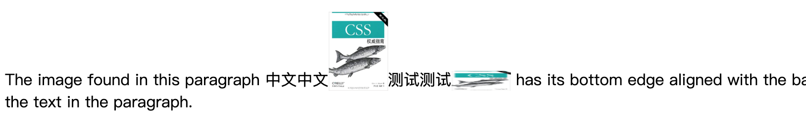
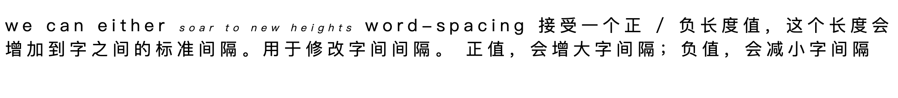
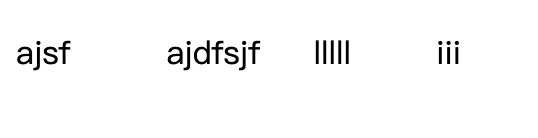

由于迫切地需要让页面外观更加美观、操作文本内容等功能，出现了一些 HTML 标记（font、center）允许对文本的外观和防止进行控制，这也看出了文本的重要性

文本和字体的区别：

文本：内容
字体：用于显示这个内容

使用文本属性可以控制文本相对于该行余下内容的位置、使其作为上标、加下划线、改变大小写等

- 缩进和水平对齐
 
    - 缩进文本
    
        将 Web 页面上段落的第一行缩进

        <html>
            <table>
                <tr>
                    <td colspan="2" style="text-align:center; font-weight: bold;">text-indent</td>
                </tr>
                <tr>
                    <td>值：</td>
                    <td><length> | <percentage> | inherit</td>
                </tr>
                <tr>
                    <td>初始值：</td>
                    <td>0</td>
                </tr>
                <tr>
                    <td>应用于：</td>
                    <td>块级元素</td>
                </tr>
                <tr>
                    <td>继承性：</td>
                    <td>有</td>
                </tr>
                <tr>
                    <td>百分数：</td>
                    <td>相对于包含块的宽度</td>
                </tr>
                <tr>
                    <td>计算值：</td>
                    <td>对于百分数值，要根据指定确定；对于长度值，则为绝对长度</td>
                </tr>
            </table>
        </html>
    - 水平对齐
    
        <html>
            <table>
                <tr>
                    <td colspan="2" style="text-align:center; font-weight: bold;">text-align</td>
                </tr>
                <tr>
                    <td>值：</td>
                    <td>left | center | right | justify | inherit</td>
                </tr>
                <tr>
                    <td>初始值：</td>
                    <td>用户代理特定的值；还可能取决于书写方向</td>
                </tr>
                <tr>
                    <td>应用于：</td>
                    <td>块级元素</td>
                </tr>
                <tr>
                    <td>继承性：</td>
                    <td>有</td>
                </tr>
                <tr>
                    <td>计算值：</td>
                    <td>根据指定确定</td>
                </tr>
            </table>
        </html>
    
        justify 属性在打印领域很常见，在 css 中少用
        
        由用户代理（而不是 css ）来确定两端对齐文本如何拉伸来填满左右便捷之间的空间。有的浏览器旨在单词之间增加额外的空间，有的会平均分布字母间的额外空间，有的会减少偶写行的空间，使文本更加紧密。
    
- 垂直对齐

    - 行高
    
        line-height 属性是指文本行基线之间的最小距离，而不是字体的大小，它确定了各个元素框的高度增加或减少多少。
        
        它定义的是最小距离，而不是绝对数值，文本基线拉开的距离可能比 line-height 值更大。line-height 并不影响替换元素的布局，不过确实可以应用到替换元素
        
        <html>
            <table>
                <tr>
                    <td colspan="2" style="text-align:center; font-weight: bold;">line-height</td>
                </tr>
                <tr>
                    <td>值：</td>
                    <td> <length> | <percentage> | <number> | normal | inherit</td>
                </tr>
                <tr>
                    <td>初始值：</td>
                    <td>normal</td>
                </tr>
                <tr>
                    <td>应用于：</td>
                    <td>所有元素</td>
                </tr>
                <tr>
                    <td>继承性：</td>
                    <td>有</td>
                </tr>
                <tr>
                    <td>百分数：</td>
                    <td>相对于元素的字体大小</td>
                </tr>
                <tr>
                    <td>计算值：</td>
                    <td>对于长度和百分数值是绝对数值；否则，根据指定确定</td>
                </tr>
            </table>
        </html>
        
        **构造文本行**
        
        文本行中的每个元素都会生成一个内容区，这由字体的大小确定。
        
        这个内容区则会生成一个行内框（inline box），如果不存在其他因素，这个行内框就完全等于该元素的内容区。由 line-height 产生的行间距就是增加或减少各行内框高度的因素之一。
        
        要确定一个给定元素的行间距，只需将 line-height 的计算值减去 fong-size 的计算值，这个值是总的行间距（可能为负值），然后将行间距的一半分别应用到内容区的顶部和底部。其结果就是该元素的行内框。
        
        
        
        **指定 line-height 值**
        
        如果使用默认值 normal，用户代理必须计算行间的垂直空间，不同的用户代理计算出的值可能不同，不过通常都是字体大小的 1.2 倍，这使得行框要高于给定元素的 font-size 值
        
        ```css
        body {line-height: 14px; font-size: 13px;}
        p.cl1 {line-height: 1.5em;}
        p.cl2 {font-size: 10px; line-height: 150%;}
        p.cl3 {line-height: 0.33in;}
        ```
        
        ```html
        <p>line-height 14px</p>
        <p class="cl1">line-height of 19.5px (13 * 1.5)</p>
        <p class="cl2">line-height of 15px (10 * 1.5)</p>
        <p class="cl3">line-height of 0.33in</p>
        ```
        
        
        **行高和继承**
        
        使用缩放因子解决继承问题
        
        如果指定值 inherit，元素则会使用其父元素的计算值，这与值自然继承没有什么不同，不过特殊性和层叠解决方案不同
        
    - 垂直对齐文本
        
        <html>
            <table>
                <tr>
                    <td colspan="2" style="text-align:center; font-weight: bold;">vertical-align</td>
                </tr>
                <tr>
                    <td>值：</td>
                    <td> baseline | sub | super | top | text-top | middle | bottom | text-bottom | <percentage> | inherit</td>
                </tr>
                <tr>
                    <td>初始值：</td>
                    <td>baseline</td>
                </tr>
                <tr>
                    <td>应用于：</td>
                    <td>行内元素和表单元格</td>
                </tr>
                <tr>
                    <td>继承性：</td>
                    <td>无</td>
                </tr>
                <tr>
                    <td>百分数：</td>
                    <td>相对于元素的 line-height 值</td>
                </tr>
                <tr>
                    <td>计算值：</td>
                    <td>对于长度和百分数值是绝对数值；否则，根据指定确定</td>
                </tr>
                <tr>
                    <td>说明：</td>
                    <td>应用到表单元格时，只能识别 baseline、top、middle、bottom等值</td>
                </tr>
            </table>
        </html>
        
        **注意：** vertical-align 不影响块级元素中内容的对齐，不过可以用它来影响表单元格中元素的垂直对齐
        
        **基线对齐**
        
        `vertical-align: baseline;`
        要求一个元素的基线与父元素的基线对齐。默认情况下，浏览器都会这么做。
        
        如果一个垂直对齐元素没有基线 —— 也就是说，如果这是个图像或表单输入元素，或其他替换元素 —— 那么该元素的底端与其父元素的基线对齐
        
        ```css
        img{width: 60px; vertical-align: baseline;}
        ```
        ```html
        <p>The image found in this paragraph 中文中文 has its bottom edge aligned with the baseline of the text in the paragraph.</p>
        ```
        
        
        
        **上标和下标**
        
        `vertical-align: sub;` 声明会使一个元素变成下标，这意味着其基线（或者如果这是一个替换元素，则是其底端）相对于其父元素的基线降低。规范没有定义元素降低的距离，所以根据不同的用户代理，降低距离可能有所不同
        
        super 刚好和 sub 相反，它将元素的基线（或替换元素的底端）相对于父元素的基线升高
        
        不会改变元素的字体大小，上标或下标元素中的所有文本默认与父元素中的文本大小相同
        
        ```css
        .raise{vertical-align: super;}
        .lower{vertical-align: sub;}
        ```
        ```html
        <p>The image found in this paragraph<span class="raise">superscripted</span> and <span class="lower">subscribe</span> the text in the paragraph.</p>
        ```
        
        
        
        **底端对齐**
        
        `vertical-align: bottom;` 将元素行内框的底端与行框的底端对齐
        
        `vertical-align: text-bottom;` 是指行内文本的底端。
        
        替换元素或任何其他类型的非文本元素会忽略这个值。对于这些元素，将考虑一个 “默认” 的文本框。这个默认框由父元素的 font-size 得到。要对齐的元素的行内框底端在与这个默认文本框的底端对齐
        
        ```css
        img{width: 60px; vertical-align: bottom;}
        img.short {height: 20px; vertical-align: text-bottom;}
        ```
        
        ```html
        <p>The image found in this paragraph 中文中文
        
        测试测试
         
        has its bottom edge aligned with the baseline of the text in the paragraph.
        </p>
        ```
        
        
        
        **顶端对齐**
        
        `vertical-align: top;`
        `vertical-align: text-top;`
        
        顶端对齐的效果与 bottom 相反
        
        **居中对齐**
        
        `vertical-align: middle;` 往往应用于图像
        
        middle 会把行内元素框的中点与父元素基线上方 0.5ex 处的一个点对齐，这里的 1ex 相对于父元素的 font-size 定义。如图： 
        
        
        
        因为大多数用户代理都把 1ex 处理为 0.5em，middle 往往将元素垂直中点与父元素基线上方 0.25em 出的一个点对齐。不过，有点用户代理确实会为个元素计算准确的 x-height（详见第 5 章）
        
        **百分数**
        
        使用百分数回把元素的基线（或替换元素的底边）相对于父元素的基线升高或降低指定的量（你指定的百分数要计算为该元素 line-height 的百分数，而不是相对于其父元素的 line-height）。正百分数会使元素升高。负值将会降低。
        
        ```css
        sup{vertical-align: 100%;}
        sub{vertical-align: -100%;}
        ```
        ```html
        <p>
            we can either
            <sup>soar to new heights</sup> or
            <sub>sink into despair...</sub>
        </p>
        ```
        
        
        ```css
        div{font-size: 14px; line-height: 18px;}
        span{vertical-align: 50%;}
        ```
        ```html
        <div>
            I felt that ,if nothing else , I deserved a
            <span>raise</span>
            for my efforts
        </div>
        ```
        
        
        **长度对齐**
        
        指定长度垂直对齐：正值使元素上升，负值使元素下降
        
        ```css
        p{vertical-align: 5px;}
        ```
        
    所有垂直对齐的元素都会影响行高。
    
    行框的描述：其高度要足以包含最高行内框的顶端和最低行内框的底端。这包括因垂直对齐上升或下降的行内框。

- 字间隔和字母间隔

    - 字间隔
        
        `word-spacing` 接受一个正 / 负长度值，这个长度会增加到字之间的标准间隔。用于修改字间间隔。
        
        正值，会增大字间隔；负值，会减小字间隔
        
        <html>
            <table>
                <tr>
                    <td colspan="2" style="text-align:center; font-weight: bold;">word-spacing</td>
                </tr>
                <tr>
                    <td>值：</td>
                    <td> <length> | normal | inherit</td>
                </tr>
                <tr>
                    <td>初始值：</td>
                    <td>normal</td>
                </tr>
                <tr>
                    <td>应用于：</td>
                    <td>所有元素</td>
                </tr>
                <tr>
                    <td>继承性：</td>
                    <td>有</td>
                </tr>
                <tr>
                    <td>计算值：</td>
                    <td>对于 normal，为绝对值 0；否则，是绝对长度</td>
                </tr>
            </table>
        </html>
        
    - 字母间隔
    
        `letter-spacing` 增加字与字之间的间隔
        <html>
            <table>
                <tr>
                    <td colspan="2" style="text-align:center; font-weight: bold;">letter-spacing</td>
                </tr>
                <tr>
                    <td>值：</td>
                    <td> <length> | normal | inherit</td>
                </tr>
                <tr>
                    <td>初始值：</td>
                    <td>normal</td>
                </tr>
                <tr>
                    <td>应用于：</td>
                    <td>所有元素</td>
                </tr>
                <tr>
                    <td>继承性：</td>
                    <td>有</td>
                </tr>
                <tr>
                    <td>计算值：</td>
                    <td>对于长度值，为绝对长队；否则，为 normal</td>
                </tr>
            </table>
        </html>
        
        normal 不是 0
        
    - 间隔与对齐
    
        `word-spacing` 的值可能受 `text-align` 属性值的影响。
        
        如果一个元素是两端对齐的，字母和字之间的空间可能会调整，以便文本在整行中刚好放下。这可能又会改变创作人员用 `word-spacing` 声明的字间隔。
        
        如果为 `letter-spacing` 指定一个长度值，字符间隔则不会受 `text-align` 影响，但是如果 `letter-spacing` 的值是 normal ，字符间的间隔就可能改变，以便将文本两端对齐。
        
        CSS 没有指定应当如何计算间隔，所以用户代理只是将其填满。
        
        一个元素的子元素会继承该元素的计算值。无法为 `word-spacing` 或  `letter-spacing` 定义一个可继承的缩放因子来取代计算值（像 `line-height` 那样），所以可以能回遇到下面的问题：
        子元素的字间隔不能按照字体来缩放
        
        ```css
        p{letter-spacing: .25em; font-size: 20px;}
        em{font-size: 50%;}
        ```
        
        ```html
        <p>
            we can either
            <em>soar to new heights</em>
            word-spacing 接受一个正 / 负长度值，这个长度会增加到字之间的标准间隔。用于修改字间间隔。
            正值，会增大字间隔；负值，会减小字间隔
        </p>
        ```
        
        
        如果字母间隔与文本大小成比例，得到字母间隔的唯一办法就是显示地设置：
        
        ```css
        p{letter-spacing: .25em; font-size: 20px;}
        em{font-size: 50%; letter-spacing: .25em;}
        ```
        
        
    
- 文本转换

    处理文本的大小写
    
    <html>
        <table>
            <tr>
                <td colspan="2" style="text-align:center; font-weight: bold;">text-transform</td>
            </tr>
            <tr>
                <td>值：</td>
                <td> uppercase | lowercase | capitalize | none | inherit</td>
            </tr>
            <tr>
                <td>初始值：</td>
                <td>none</td>
            </tr>
            <tr>
                <td>应用于：</td>
                <td>所有元素</td>
            </tr>
            <tr>
                <td>继承性：</td>
                <td>有</td>
            </tr>
            <tr>
                <td>计算值：</td>
                <td>根据指定确定</td>
            </tr>
        </table>
    </html>
    
    none：默认值，不做任何改动
    
    uppercase：将文本转为全大写
    
    lowercase：将文本转为全小写
    
    capitalize：只对每个单词的首字母大写
    
    不同用户代理可能会用不同的方法来确定单词从哪里开始，相应地确定哪些字母要大写
    所以：
    
    `heading-one` 可能转换为 `Heading-one` 或 `Heading-One`

- 文本装饰

    <html>
        <table>
            <tr>
                <td colspan="2" style="text-align:center; font-weight: bold;">text-decoration</td>
            </tr>
            <tr>
                <td>值：</td>
                <td> none | [underline || overline || line-through || blink] | inherit</td>
            </tr>
            <tr>
                <td>初始值：</td>
                <td>none</td>
            </tr>
            <tr>
                <td>应用于：</td>
                <td>所有元素</td>
            </tr>
            <tr>
                <td>继承性：</td>
                <td>无</td>
            </tr>
            <tr>
                <td>计算值：</td>
                <td>根据指定确定</td>
            </tr>
        </table>
    </html>
    
    underline：对元素加下划线
    overline：对元素加上划线
    line-through：删除线
    blink：让文本闪烁
    
    ```css
    p.underline{text-decoration: underline;}
    p.overline{text-decoration: overline;}
    p.through{text-decoration: line-through;}
    p.blink{text-decoration: blink;}
    ```
    
    ```html
    <p class="underline">underline underline underline underline underline underline </p>
    <p class="overline">overline overline overline overline overline overline </p>
    <p class="through">line-through line-through line-through line-through line-through </p>
    <p class="blink">blink blink blink blink blink blink blink blink blink </p>
    ```
    
    
    
    - 怪异的装饰
    
        `text-decoration` 没有继承性意味着文本上画的任何装饰线（上划线或删除线）与父元素的颜色相同，即使后代元素本身有其他颜色也是如此：
        
        ```css
        p{text-decoration: underline; color: black;}
        strong{color:gray;}
        ```
        
        ```html
        <p>没有继承性意味着文本上画的任何装饰线（上划线或删除线）与<strong>父元素的颜色相同</strong>，即使后代元素本身有其他颜色也是如此</p>
        ```
        
        
        
        本来由于没有继承性，strong 元素应该没有下划线的，但是它的下划线只不过是 p 元素的下划线 “经过” 了 strong 元素而已
        
        即使把 strong 元素的 `text-decoration` 设置为 none，也和上面一样
        
        ```css
        p{text-decoration: underline; color: black;}
        strong{color:gray; text-decoration: none;}
        ```
        
        `text-decoration` 和 `vertical-align` 结合时，会发生奇怪的现象：
        ```css
        p{text-decoration: overline; color: black;}
        sup{color:gray; vertical-align: 50%;}
        ```
        ```html
        <p>没有继承性意味着文本上画的任何装饰线（上划线或删除线）与<sup>父元素的颜色相同</sup>，即使后代元素本身有其他颜色也是如此</p>
        ```
        
        
        并且，strong 元素的上划线颜色与父元素一样，如果要让子元素的上划线颜色与本身一直，则需要显示声明装饰：
        ```css
        p{text-decoration: overline; color: black;}
        sup{text-decoration: overline; color:gray; vertical-align: 50%;}
        ```

- 文本阴影
    
    为文本增加阴影

    <html>
        <table>
            <tr>
                <td colspan="2" style="text-align:center; font-weight: bold;">text-shadow</td>
            </tr>
            <tr>
                <td>值：</td>
                <td> none | [<color> || <length> <length> <length>?,]* [<color> ||  <length> <length> <length>?] | inherit</td>
            </tr>
            <tr>
                <td>初始值：</td>
                <td>none</td>
            </tr>
            <tr>
                <td>应用于：</td>
                <td>所有元素</td>
            </tr>
            <tr>
                <td>继承性：</td>
                <td>无</td>
            </tr>
        </table>
    </html>

    前两个长度确定了阴影与文本的偏移距离，第三个长度值可选，定义了阴影的 “模糊半径”。
    
    可以定义多个阴影
    
    定义一个相对文本向右偏移 5px 向下偏移 0.5em 的绿色阴影，而且不模糊：
    
    ```css
    text-shadow: green 5px .5em;
    ```
    
    负长度会使阴影落在原文本的左上方
    
    模糊半径定义为从阴影轮廓到模糊效果边界的距离。
    
    具体的模糊方法并未定义，所以不同代理可能会有不同的效果
    
    ```css
    p{margin: 50px auto;}
    p.cl1{color: black; text-shadow: silver 2px 2px 2px;}
    p.cl2{color: white; text-shadow: 0 0 4px black;}
    p.cl3{color: black; text-shadow: 1em 1em 5px gray, -1em -1em silver;}
    ```
    
    ```html
    <p class="cl1">模糊半径定义为从阴影轮廓到模糊效果边界的距离。</p>
    <p class="cl2">模糊半径定义为从阴影轮廓到模糊效果边界的距离。</p>
    <p class="cl3">模糊半径定义为从阴影轮廓到模糊效果边界的距离。</p>
    ```
    
    
    
- 处理空白符

    它会影响用户代理对源文档中的空格、换行和 tab 字符的处理
    
    <html>
        <table>
            <tr>
                <td colspan="2" style="text-align:center; font-weight: bold;">white-space</td>
            </tr>
            <tr>
                <td>值：</td>
                <td> normal | nowrap | pre  | pre-wrap | pre-line | inherit</td>
            </tr>
            <tr>
                <td>初始值：</td>
                <td>normal</td>
            </tr>
            <tr>
                <td>应用于：</td>
                <td>所有元素（CSS2.1）；块级元素（CSS1 和 CSS2）</td>
            </tr>
            <tr>
                <td>继承性：</td>
                <td>无</td>
            </tr>
            <tr>
                <td>计算值：</td>
                <td>根据指定确定</td>
            </tr>
        </table>
    </html>
    
    使用这个属性，可以影响浏览器处理字之间和文本行之间的空白符的方式。从某种程度上将，默认的 XHTML 处理已经完成了空白符处理：它会把所有空白符（包括回车换行）合并为一个空格：
    
    ```html
    <p>ajsf         ajdfsjf          lllll        iii</p>
    ```
    
    
    `white-space: pre;`
    
    空白符不会被忽略，换行也会显示出来
    
    
    
    `white-space: nowrap;`
    
    会防止文本换行，和默认的效果差不多，除非使用 br 元素
    
    `white-space: pre-wrap;`
    保留空白符序列，但是文本行会正常地换行，如果设置这个值，源文本中的行分隔符以及生成的行分隔符也会保留
    
    `white-space: pre-line;`
    
    和 `pre-wrap` 相反，会像正常文本中医院合并空白符序列，但保留换行符
    
    **总结**
    
    值 | 空白符 | 换行符 | 自动换行
    ---|---|---|---
    pre-line | 合并 | 保留 | 允许
    normal | 合并 | 忽略 | 允许
    nowrap | 合并 | 忽略 | 不允许
    pre | 保留 | 保留 | 不允许
    pre-wrap | 保留 | 保留 | 允许

    
- 文本方向
    
    <html>
        <table>
            <tr>
                <td colspan="2" style="text-align:center; font-weight: bold;">direction</td>
            </tr>
            <tr>
                <td>值：</td>
                <td> ltr | rtl | inherit</td>
            </tr>
            <tr>
                <td>初始值：</td>
                <td>ltr</td>
            </tr>
            <tr>
                <td>应用于：</td>
                <td>所有元素</td>
            </tr>
            <tr>
                <td>继承性：</td>
                <td>有</td>
            </tr>
            <tr>
                <td>计算值：</td>
                <td>根据指定确定</td>
            </tr>
        </table>
    </html>

    direction 属性影响块级元素中文本的书写方向、表中列布局的方向、内容水平填充其元素框的方向，以及两端对齐元素中最后一个行的位置
    
    对于行内元素，只有当 unicode-bidi 属性为 embed 或 bidi-override 时才会应用 direction 属性
    
    浏览器可能会有以下内部规则：
    
    ```css
    阿拉伯语和希伯来语规则
    *:lang(ar), *:lang(he) {direction: rtl;}
    ```
    
    尽管 css 试图处理书写方向，但 Unicode 有一种更健壮的方法来处理方向性。

    <html>
        <table>
            <tr>
                <td colspan="2" style="text-align:center; font-weight: bold;">unicode-bidi</td>
            </tr>
            <tr>
                <td>值：</td>
                <td> normal | embed | bidi-override | inherit</td>
            </tr>
            <tr>
                <td>初始值：</td>
                <td>normal</td>
            </tr>
            <tr>
                <td>应用于：</td>
                <td>所有元素</td>
            </tr>
            <tr>
                <td>继承性：</td>
                <td>无</td>
            </tr>
            <tr>
                <td>计算值：</td>
                <td>根据指定确定</td>
            </tr>
        </table>
    </html>
    
    1、normal
    
    元素不会对双向算法打开附加的一层嵌套。对于行内元素，顺序的隐式重排会跨元素边界进行
    
    2、embed
    
    如果一个行内元素，这个值对于双向算法会打开附加的一层嵌套。这个桥涛曾的方向由 direction 属性指定。会在元素内部隐式地完成顺序重排。这对应于元素开始处增加一个 LRE（对于 direction: ltr: U+202A）或 RLE（对于 direction: rtr: U+202B），并在元素的最后增加一个 PDF（U+202C）
    
    3、bide-override
    
    这会为行内元素创建一个覆盖。对于块级元素，将为不在另一块中的行内后代创建一个覆盖。这说明顺序重排在元素内部严格按照 direction 属性进行；忽略了双向算法的隐式部分。这对于在元素开始处增加一个 LRO（对于 direction: ltr: U+202D）或 RLO（对于 direction: tr: U+202E），并在元素最后增加一个 PDF（U+202C）